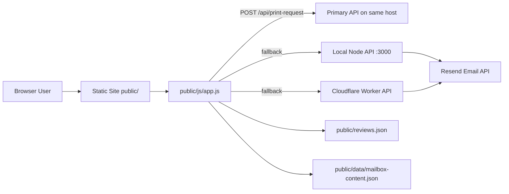

# Shipping with Purpose (SRT-SWP)

Transfer-of-ownership reference guide for the Shipping with Purpose website and form backends.

## Legal Notice

All code in this repository is not for personal or unauthorized use. If you are caught using any part of this source code without explicit permission, legal action will be taken to protect the owner. This is a public repository, but usage is restricted.

---

## 1) What This Project Is

This project is a marketing and lead-capture site for a local shipping center.

It has three runtime parts:

1. Static frontend (HTML/CSS/JS) served from `public/`.
2. Optional Node backend in `server/` for form submission APIs.
3. Cloudflare Worker fallback in `worker-print/` for the same APIs.

The frontend is designed so form submissions can try multiple API targets in order:

1. Relative path `/api` (same host as site)
2. Local backend `http://localhost:3000/api`
3. Worker URL `https://srt-swp.p-vedant7878.workers.dev/api`

This means the site still works if one backend target is down, as long as another target responds with JSON.

---

## 2) High-Level Architecture



Ownership-critical detail: frontend behavior is dependency-light and mostly data-driven from JSON. Content updates usually do not require JS edits.

---

## 3) Repository Map (What Owns What)

### Root

- `README.md`: this handoff document.
- `CNAME`: custom domain (`shippingwithpurpose.com`).
- `package.json`: root scripts for CSS bundling + live static preview.

### Source CSS (authoring only)

- `src/css/main-home.css`
- `src/css/main-services.css`
- `src/css/main-mailboxes.css`
- `src/css/main-print.css`
- `src/css/blocks/*.css`

Do edits here, not in bundles.

### Deployed frontend

- `public/*.html`: pages.
- `public/partials/header.html`, `public/partials/footer.html`: reusable HTML loaded at runtime.
- `public/css/*.bundle.css`: generated CSS bundles (committed artifacts).
- `public/js/app.js`: primary frontend logic (currently minified/packed style).
- `public/js/components.js`: partial include loader + nav active-state logic.
- `public/reviews.json`: review feed data.
- `public/data/mailbox-content.json`: mailbox pricing/content data source.
- `public/_headers`, `public/_redirects`: host routing/security/cache directives.

### Node backend

- `server/index.js`: Express app + middleware + static serving + route registration.
- `server/routes/printRequest.js`: multipart print request route.
- `server/routes/reservationRequest.js`: mailbox reservation route.

### Worker backend

- `worker-print/index.js`: Cloudflare Worker equivalent API endpoints.
- `worker-print/wrangler.toml`: worker configuration.

### Utility scripts

- `scripts/build-css.js`: CSS inliner/minifier/bundle writer.
- `scripts/find-yelp.js`, `scripts/yelp-find-business.js`: Yelp lookup helper scripts.

---

## 4) Page-Level Asset Loading

Every page loads:

- Shared header via `<div data-include="/partials/header.html"></div>`
- Shared footer via `<div data-include="/partials/footer.html"></div>` (where present)
- `public/js/components.js`
- `public/js/app.js`

The page then pulls the page-specific CSS bundle:

- Home: `/css/styles.bundle.css`
- Services: `/css/services.bundle.css`
- Mailboxes: `/css/mailboxes.bundle.css`
- Print: `/css/print.bundle.css`

Also in production pages:

- Inline critical CSS is embedded in `<style>` in each HTML head for early rendering.
- Font files are preloaded.

---

## 5) CSS Bundle System (How It Works)

### Why this exists

Authoring CSS is modular (`src/css/blocks/*`) but runtime CSS is a single bundle per page to avoid many render-blocking `@import` requests.

### Build process

`npm run build:css` runs `scripts/build-css.js` which:

1. Reads each `src/css/main-*.css` entry file.
2. Inlines every `@import url("...")` in place.
3. Applies conservative minification (comments/whitespace punctuation cleanup).
4. Writes generated file to `public/css/*.bundle.css` with a warning banner.

### Entry -> output mapping

- `main-home.css` -> `styles.bundle.css`
- `main-services.css` -> `services.bundle.css`
- `main-mailboxes.css` -> `mailboxes.bundle.css`
- `main-print.css` -> `print.bundle.css`

### Import order matters

The order in each `main-*.css` is the cascade contract. For example, `main-home.css` imports:

1. `base.css`
2. `nav.css`
3. `info-bar.css`
4. `footer.css`
5. `forms.css`
6. `hero.css`
7. `services-preview.css`
8. `mailbox-preview.css`
9. `print.css`
10. `dropoff.css`
11. `testimonials.css`
12. `pricing.css`
13. `reservation.css`

If ownership changes this order, visual regressions can happen.

### Golden rule for ownership transfer

Do not hand-edit `public/css/*.bundle.css`. Always edit `src/css/*` and rebuild.

---

## 6) Frontend JavaScript Runtime (Detailed)

Main logic lives in `public/js/app.js`.

### 6.1 API failover client

`apiRequest(path, options)` loops through API targets in this sequence:

1. `/api`
2. `http://localhost:3000/api`
3. `https://srt-swp.p-vedant7878.workers.dev/api`

For each target, it:

- calls `fetch`
- requires `content-type` including `application/json`
- parses JSON
- throws on non-2xx, using `error` field when present

If all fail, it throws the last error.

### 6.2 Header/mobile nav

`initNav()`:

- binds hamburger menu toggle
- flips icon menu/close
- updates `aria-expanded`
- closes mobile menu on nav link click
- guards against duplicate initialization with `data-nav-initialized`

It runs immediately and again after components are loaded.

### 6.3 Fade-in sections

IntersectionObserver watches `.fade-section` and adds `.visible` once each section intersects.

### 6.4 Print portal behavior (`print.html`)

When `#print-portal-form` exists, script enables:

- drag/drop upload zone
- click-to-select files
- duplicate file protection
- per-file and aggregate size guard (25 MB total)
- per-field validation for name/copies
- remove uploaded file by index
- submit as multipart `FormData` to `/print-request`

Sent fields:

- `name`
- `printType`
- `copies`
- optional `instructions`
- repeated `files`

On success:

- success message shown
- form reset
- local uploaded file state cleared

On error:

- error message shown in feedback region

### 6.5 Mailbox content loader (data-driven pages)

`loadMailboxContent()` tries to fetch in order:

1. `data/mailbox-content.json`
2. `/data/mailbox-content.json`

If fetch fails, it uses embedded fallback content object in JS.

The loaded content populates elements using data attributes:

- `data-mailbox-field`
- `data-mailbox-plan-name`
- `data-mailbox-plan-desc`
- card/service fields on services page

### 6.6 Quote calculator (`mailboxes.html`)

When `#quote-calculator` exists, script:

- reads plan pricing from mailbox content JSON
- tracks selected size/term/add-on
- applies add-on price (`pricePerMonth`) multiplied by selected term length
- updates quote card (`q-price`, `q-monthly`, `q-config`, `q-items`)
- syncs button groups and mobile selects
- supports URL prefills via `?box=<mini|personal|business|corporate>&term=<3|6|12>`

### 6.7 Pricing modal (`mailboxes.html`)

Modal opens from `#pricing-table-trigger` and closes by:

- close button
- overlay click
- Escape key

Also toggles body scroll lock.

### 6.8 FAQ accordion (`services.html`)

One-open-at-a-time behavior for `.faq-item` blocks.

### 6.9 Reviews feed (`index.html`)

`loadLiveReviews()`:

- targets `#reviews-container`
- fetches from `reviews.json` then `/reviews.json`
- sanitizes text before render
- builds review cards with initials avatar and SVG stars
- computes/falls back relative time
- supports horizontal prev/next controls
- includes auto-scroll carousel timer (~3.5s) with pause on hover/touch
- shows placeholder messages for loading/empty/error states

### 6.10 Reservation drawer (`mailboxes.html`)

Drawer opens from `.mailbox-cta__tile--price` and `.quote-cta`.

Features:

- step UI with progress indicators
- dynamic price display from selected mailbox type + term
- `POST /reservation-request` JSON submission
- loading spinner/button state control
- success transition + confetti effect
- close by overlay, close button, or Escape

Request payload:

- `name`
- `company`
- `phone`
- `email`
- `mailboxType`
- `term`
- `mailNotification`

### 6.11 Footer year

`updateFooterYear()` writes current year into `#footer-year`.

### 6.12 Important implementation note

Reservation drawer price reads from `window.mailboxContent || MAILBOX_FALLBACK_CONTENT`. Current script does not assign `window.mailboxContent` during load, so drawer price can rely on fallback values even when JSON loads newer values. This is not a crash issue, but ownership team should keep this behavior in mind when validating pricing changes.

---

## 7) `components.js` Behavior

`includeComponents()`:

1. Finds every `[data-include]` node.
2. Fetches the include path.
3. Injects fetched HTML into node.
4. Calls nav link highlighting and emits `components:loaded` custom event.

`highlightActiveNavLink()` maps routes:

- `/` and `/index.html` -> home
- `/mailboxes` and `/mailboxes.html` -> mailbox
- `/print` and `/print.html` -> print
- `/services` and `/services.html` -> services

This is why nav active state still works with extensionless routes.

---

## 8) Data Contracts

### 8.1 Reviews data file

Path: `public/reviews.json`

Expected shape: array of review objects.

Fields used by UI:

- `author` (string)
- `source` (string, usually `Google`)
- `rating` (number 1-5)
- `text` (string)
- `daysAgo` (number, optional)
- `relativeTime` (string, optional, like `2 weeks ago`)

If `daysAgo` is absent, script parses `relativeTime`. If both are weak/missing, defaults are applied.

### 8.2 Mailbox content file

Path: `public/data/mailbox-content.json`

Top-level keys currently include:

- `hero`
- `cta`
- `quote`
- `plans`
- `reservation`
- `servicesOverview`

Critical pricing contract:

- `plans.<PlanName>.pricing["3-Month"|"6-Month"|"12-Month"]`
- `quote.addon.pricePerMonth`

If ownership edits plan names, update both JSON keys and HTML data attributes that reference names.

---

## 9) Backend (Node Express)

Location: `server/`

### 9.1 Startup and middleware

`server/index.js`:

- loads env via `dotenv`
- parses JSON/urlencoded bodies (25 MB limits)
- enables CORS (GET/POST/OPTIONS)
- injects security headers
- serves static `public/`
- mounts route files
- exposes `/api/health`

Security headers include:

- `X-Frame-Options: DENY`
- `Cross-Origin-Opener-Policy: same-origin`
- `X-Content-Type-Options: nosniff`
- `Referrer-Policy: strict-origin-when-cross-origin`
- CSP policy string
- HSTS when request indicates HTTPS

### 9.2 Reservation route

`POST /api/reservation-request`

File: `server/routes/reservationRequest.js`

- rate limit: 60 requests / 10 minutes
- validates required fields and email format
- sanitizes/normalizes values (`validator`)
- sends plain-text email using Resend SDK
- recipient defaults to `mail@shippingwithpurpose.com` if env missing

### 9.3 Print route

`POST /api/print-request`

File: `server/routes/printRequest.js`

- rate limit: 30 requests / 10 minutes
- multipart upload via `multer.memoryStorage`
- file count max: 10
- total upload max: 25 MB
- MIME allowlist:
  - PDF
  - DOC
  - DOCX
  - PNG
  - JPEG
- sanitizes text fields
- sends email with attachments via Resend SDK
- recipient defaults to `print@shippingwithpurpose.com` if env missing

### 9.4 Required environment variables

For both Node and Worker APIs:

- `RESEND_API_KEY` (required)
- `RESEND_FROM_EMAIL` (required)
- `RESERVATION_TO_EMAIL` (optional)
- `PRINT_PORTAL_TO_EMAIL` (optional)

---

## 10) Backend (Cloudflare Worker)

Location: `worker-print/`

### 10.1 Endpoints

- `GET /api/health`
- `POST /api/reservation-request` (JSON)
- `POST /api/print-request` (multipart/form-data)

### 10.2 Behavior details

The Worker mirrors Node route intent:

- CORS headers for cross-origin form posts
- required field checks
- 25 MB print upload cap
- attachment conversion to base64 for Resend HTTP API

### 10.3 Secrets/config

`wrangler.toml` comments define expected secrets:

- `RESEND_API_KEY`
- `RESEND_FROM_EMAIL`
- optional destination emails

---

## 11) Local Development and Testing Runbook

## 11.1 Frontend static preview

At repo root:

```bash
npm install
npm run build:css
npm run dev:live
```

Preview URL: `http://localhost:5500`

`npm run preview` does build + live-server in one command.

## 11.2 Node API local run

In `server/`:

```bash
npm install
npm run dev
```

API URL: `http://localhost:3000/api`

Health check:

```bash
curl http://localhost:3000/api/health
```

## 11.3 Worker local run

In `worker-print/` (with Wrangler installed):

```bash
wrangler dev
```

Worker local endpoint usually runs on `http://localhost:8787`.

Because frontend `API_TARGETS` already includes local Node and worker fallback URL, local tests should verify which target responded.

## 11.4 Ownership smoke test checklist

1. Home page loads header/footer includes.
2. Mobile nav opens/closes and active nav state is correct.
3. Reviews carousel loads from JSON and scroll controls work.
4. Services FAQ accordion toggles one item at a time.
5. Mailbox quote updates on size/term/add-on changes.
6. Pricing modal opens/closes via all close paths.
7. Reservation drawer submits successfully and shows step 2 success.
8. Print portal validates file limits and submits attachments.
9. Footer year reflects current year.
10. `/api/health` responds on whichever backend is live.

---

## 12) Deployment and Ownership Transfer Checklist

This is the minimum handoff sequence for a new owner/team.

1. Source control transfer
   - transfer repository admin rights
   - confirm branch protections and deploy branch
2. Domain transfer
   - verify registrar ownership and DNS access
   - preserve `CNAME` target behavior
3. Hosting/CDN transfer
   - transfer account for platform consuming `public/`
   - verify `_headers` and `_redirects` are applied in production
4. Email infrastructure transfer
   - transfer Resend account/project and API key ownership
   - validate sender domain and `RESEND_FROM_EMAIL`
5. Secrets migration
   - set all required env vars in Node host and/or Worker
6. Form delivery verification
   - confirm both reservation and print emails arrive at new inboxes
7. Worker ownership
   - transfer Cloudflare account/project + Wrangler access if worker remains active
8. Monitoring/log access
   - ensure new owner can inspect runtime errors and delivery failures
9. Final acceptance
   - run full smoke test checklist from section 11.4

---

## 13) Content Update Playbooks

### 13.1 Update reviews shown on home page

1. Edit `public/reviews.json`.
2. Keep valid JSON array.
3. Include at least `author`, `rating`, `text` per item.
4. Deploy.

No rebuild needed for reviews-only updates.

### 13.2 Update mailbox pricing/content

1. Edit `public/data/mailbox-content.json`.
2. Update `plans` pricing and any labels/descriptions.
3. Validate quote calculator and reservation drawer values.
4. Deploy.

No CSS rebuild needed for JSON-only content updates.

### 13.3 Update page styling

1. Edit `src/css/blocks/*` and/or `src/css/main-*.css`.
2. Run `npm run build:css`.
3. Verify changed bundle file(s) in `public/css/`.
4. Deploy.

---

## 14) Known Constraints and Risks

1. `public/js/app.js` is committed minified-like output with no JS build pipeline in root scripts; debugging is harder.
2. Reservation drawer dynamic price path currently can rely on JS fallback content instead of loaded JSON (see section 6.12).
3. Worker README in `worker-print/README.md` is outdated relative to current endpoint payload expectations (current worker supports reservation JSON and print multipart).
4. Security and cache policy correctness depends on host support for `_headers` and `_redirects` semantics.

---

## 15) Commands Reference

### Root

```bash
npm install
npm run build:css
npm run dev:live
npm run preview
```

### Server

```bash
cd server
npm install
npm run dev
```

### Worker

```bash
cd worker-print
wrangler secret put RESEND_API_KEY
wrangler secret put RESEND_FROM_EMAIL
wrangler secret put RESERVATION_TO_EMAIL
wrangler secret put PRINT_PORTAL_TO_EMAIL
wrangler dev
wrangler publish
```

### Yelp utility scripts

From repo root (requires `.env` with `YELP_API_KEY`):

```bash
node scripts/find-yelp.js "Business Name" "City, ST"
node scripts/yelp-find-business.js "Business Name" "City, ST"
```

---

## 16) If You Need to Rebuild Trust in Production Quickly

Fast diagnostic order during incidents:

1. Open `/api/health` on primary backend.
2. Submit test reservation with obvious marker text.
3. Submit tiny print request file (<1 MB).
4. Check email inboxes for both routes.
5. Check browser console for include/load failures.
6. Confirm `reviews.json` and `mailbox-content.json` are reachable.
7. Confirm `_redirects` route behavior and custom domain DNS.

---

## 17) Preservation Rule for Future Teams

For safe continuity, preserve this principle:

- author from `src/`
- ship from `public/`
- treat JSON files as business-content control plane
- keep both backend paths (Node + Worker) documented even if only one is active

---

## Legal Notice (Repeated)

All code in this repository is not for personal or unauthorized use. If you are caught using any part of this source code without explicit permission, legal action will be taken to protect the owner. This is a public repository, but usage is restricted.
